This tutorial explains how to use the open-source tool llmfit to find out which open-source large language models (LLMs) a machine can run before you download them, and how to run the models with Ollama to verify whether llmfit's estimates are accurate.

The tests are split into two parts: a MacBook M1 with 8GB of memory, and an NVIDIA GeForce RTX 4090 instance on Glows.ai. We compare the model sizes, speeds, and answer quality each machine can handle.

This tutorial covers:

- Prerequisites (installing llmfit and Ollama)
- Getting to know the llmfit interface
- MacBook test 1: Llama 3.2 1B
- MacBook test 2: Qwen3 4B (when a model exceeds the memory limit)
- Glows.ai RTX 4090 test: Qwen3.6 27B
- Summary of results and recommendations

## Introduction to llmfit

[llmfit](https://github.com/AlexsJones/llmfit) is an open-source terminal tool. There are tens of thousands of open-source models, and each comes in several compressed versions. Picking one by gut feeling often ends in out-of-memory errors or painfully slow speeds. llmfit detects your machine's CPU, memory, and GPU, and tells you **before you download a model**:

- Whether the machine can run the model (the Fit level)
- Which compressed version to choose
- How many tokens per second to expect

llmfit only evaluates; it does not run models. To actually run a model you need a tool like Ollama: a model file is just a large block of data, and Ollama loads it into memory and computes the answers.

## Prerequisites

### 1. Install llmfit

On macOS, install with Homebrew:

```bash
brew install llmfit
```

On Linux (for example, a Glows.ai instance), use the official install command:

```bash
curl -fsSL https://llmfit.axjns.dev/install.sh | sh
```

After installation, check the version with the following command. This tutorial uses llmfit 1.1.16.

```bash
llmfit --version
```

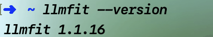

### 2. Install Ollama

On macOS, download the installer from [ollama.com](https://ollama.com), drag it into the Applications folder, and open it. After installation, check the version:

```bash
ollama --version
```

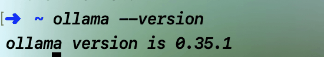

### 3. Prepare a Standard Test Question

For a fair comparison, every model in this tutorial is given the same question:

```text
Explain what a GPU is in about 150 words.
```

## Part 1: Getting to Know the llmfit Interface (MacBook M1 8GB)

### 1. Open llmfit

Run:

```bash
llmfit
```

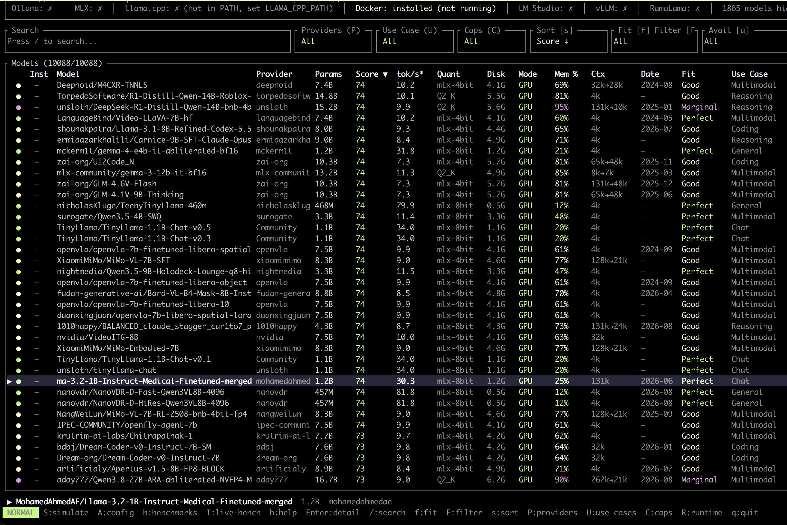

The top two lines show the hardware and runtimes llmfit detected:

- **CPU / RAM / GPU**: This MacBook M1 has 8GB of unified memory, shared by the CPU and GPU
- **RAM: X GB avail**: The memory that is **actually available** right now, which matters a lot later on
- **Ollama / MLX / llama.cpp**: The model runtimes detected. None are installed on this machine, so they show `X`

Even if Ollama is installed, it may still show ✗ here. This does not affect llmfit's evaluation; it only affects llmfit's built-in benchmarking feature.

### 2. Column Reference

| Column | Description |
|---|---|
| **Provider** | The model publisher. Prefer official sources (Meta, Alibaba, Google) or well-known converters (unsloth, mlx-community) |
| **Params** | Parameter count. For example, 1.1B means 1.1 billion parameters. Larger is usually smarter but uses more memory |
| **Score** | Overall score (0–100), a weighted combination of quality, speed, fit, and context length |
| **tok/s\*** | Estimated tokens generated per second. The asterisk means it is an estimate |
| **Quant** | The compressed version llmfit used for the evaluation |
| **Mem %** | How much memory the model will use. **Lower is safer**; staying under 70% is recommended |
| **Ctx** | Context length. "262k→10k" means the model supports 262k but can only be opened at 10k on this machine |
| **Fit** | The fit level, explained below |
| **Use Case** | What the model is for, such as Chat, Coding, or Multimodal |

### 3. Fit Levels

Press `f` to filter models by Fit level. There are four levels:

| Level | Description |
|---|---|
| **Perfect** | Plenty of memory; runs smoothly. Recommended first choice |
| **Good** | Runs, with minor compromises |
| **Marginal** | Barely fits in memory; the actual experience is poor |
| **Too Tight** | Not enough memory; cannot run |

**Perfect**: Low memory usage, with the full context length preserved.

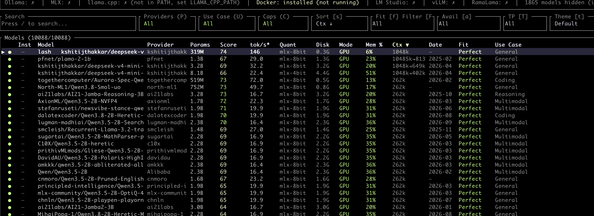

**Marginal**: Memory usage is 85%–92%. Most models are compressed to Q2_K or Q3_K_M, and the context length is cut significantly.

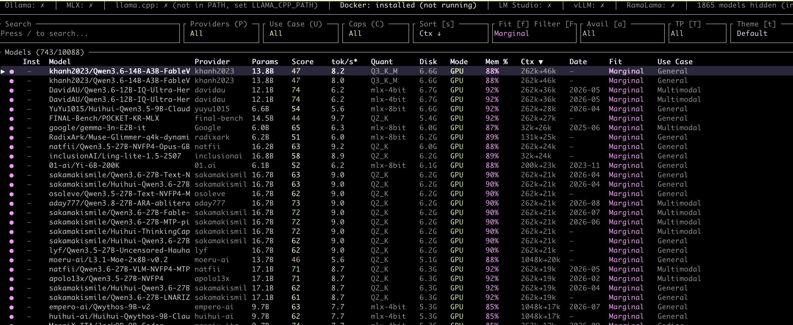

**Too Tight**: Memory usage exceeds 100% and the model cannot run. The speeds shown at this level are not meaningful.

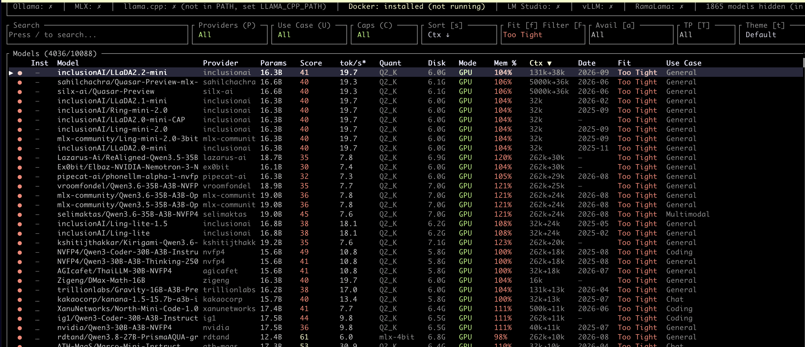

### 4. Filter and Sort to Pick a Suitable Model

Set the filters in order: press `f` to switch to **Perfect**, `U` to **Chat**, and `s` to **Score**. The model at the top is "the chat model that runs most smoothly on this machine." The first place is **unsloth/Llama-3.2-1B-Instruct-GGUF**.

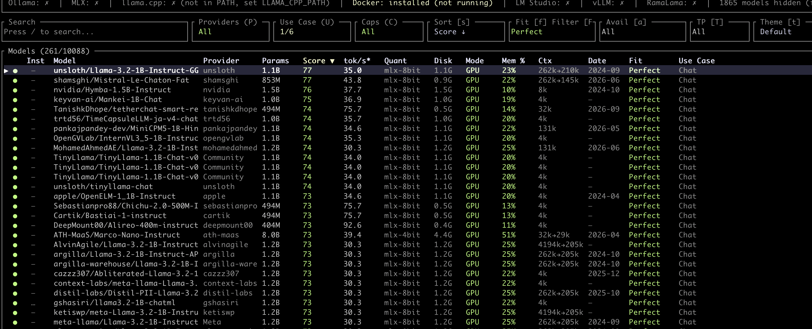

The highest Score does not mean the smartest model. Score is a balanced score "on this machine," and small models tend to rank first because they are fast and memory is plentiful. If you want a smarter model, sort by parameter count within Perfect and choose a larger one, at the cost of speed.

### 5. Common Shortcuts

Shortcuts are **case-sensitive**; uppercase and lowercase keys do different things:

| Key | Function |
|---|---|
| `/` | Search model names |
| `f` | Filter by Fit level |
| `U` | Filter by use case |
| `s` | Change the sort order |
| `S` (uppercase) | Simulate other hardware specs |
| `Enter` | View details for a model |
| `h` | List all shortcuts |
| `q` | Quit |

## Part 2: MacBook Test 1: Llama 3.2 1B

### 1. View llmfit's Evaluation

Press `/` and search for `llama-3.2-1b`. The same model has many converted versions; choose the one whose Provider is **unsloth**.

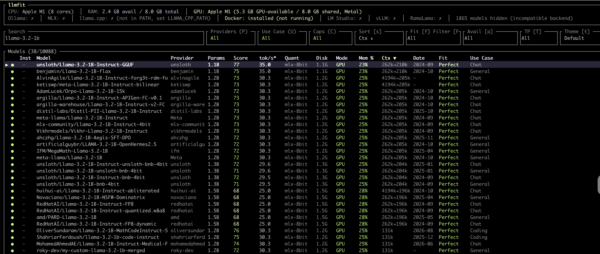

With it selected, press `Enter` to see the details. The key items are:

- **Fit Level**: Perfect, Run Mode is GPU
- **Baseline Est**: Estimated 35.0 tok/s
- **Mem Usage**: 22.7% (about 1.8GB / 8GB)
- **Score Breakdown**: Quality 54, Speed 88, Fit 100, Context 100

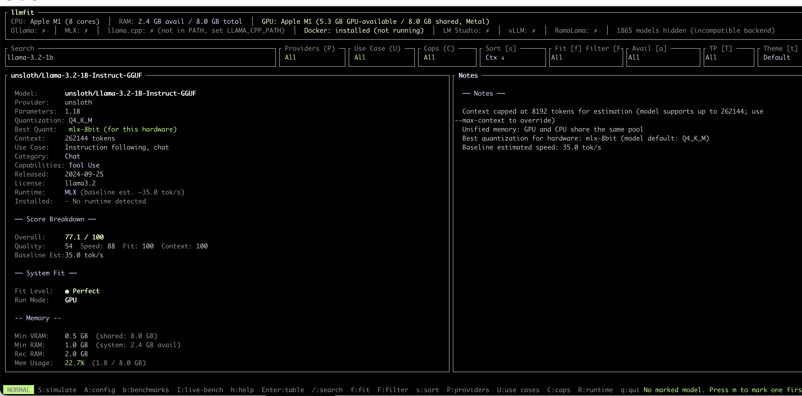

The score breakdown shows what this model is like: fast and with plenty of memory to spare, but a low quality score.

### 2. Run the Model with Ollama

Run:

```bash
ollama run hf.co/unsloth/Llama-3.2-1B-Instruct-GGUF:Q8_0 --verbose
```

**Model name format:** `hf.co/` + the model name in llmfit + `:` + the compressed version. Ollama downloads the model directly from Hugging Face. If the model name in llmfit is not in GGUF format, you can find available download sources under **GGUF Downloads** on the right side of the details page.

The `--verbose` flag prints speed statistics after every answer. To leave the chat, type `/bye`.

Once the download finishes, you enter the chat. Type `hello` to test it first.

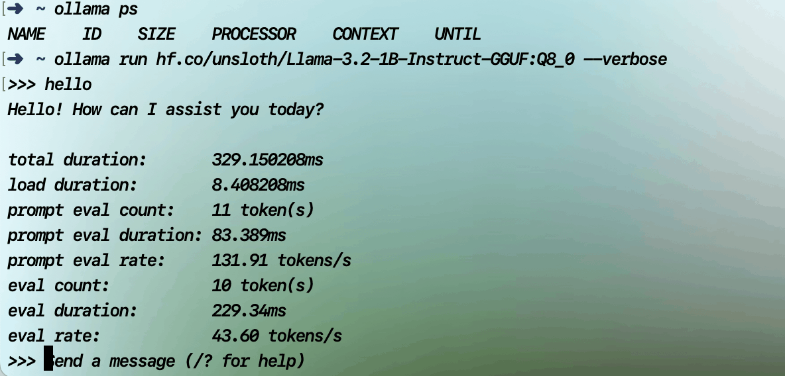

### 3. Measured Speed and Answer Quality

After entering the test question, the **eval rate** in the statistics is the actual generation speed: **42.53 tokens/s**, slightly faster than llmfit's estimate of 35 tok/s.

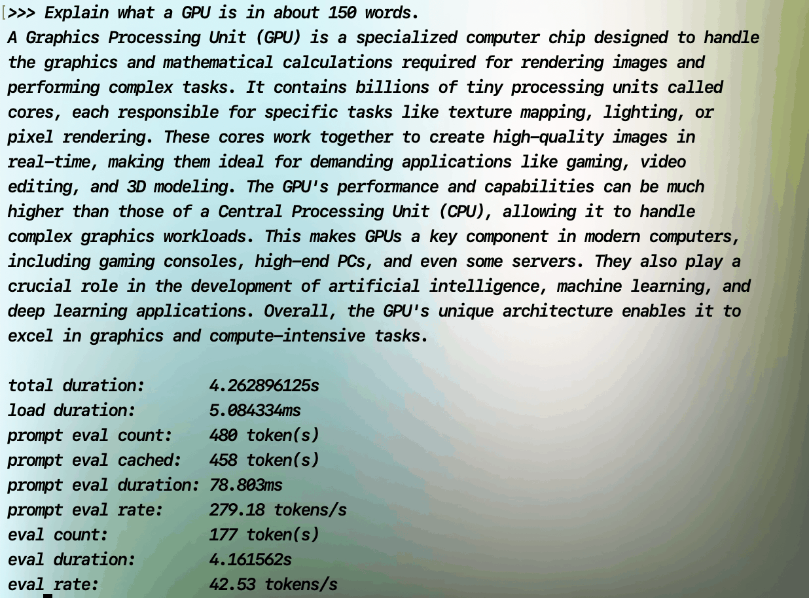

The answer is fluent and the length is well controlled, but the content contains an error: the model says a GPU has "billions of cores." In reality a GPU has thousands to roughly ten-thousand-plus cores; "billions" is the number of transistors. This matches the quality score of 54 given by llmfit.

### 4. Check Memory Usage

Open another terminal tab and run:

```bash
ollama ps
```

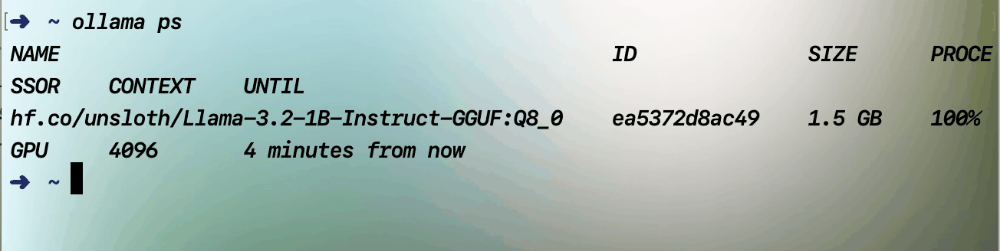

**SIZE** is 1.5GB, close to llmfit's estimate of about 1.8GB. **PROCESSOR** is 100% GPU, meaning the model is fully loaded on the GPU.

### 5. Estimate vs. Measured

| Item | llmfit estimate | Measured |
|---|---|---|
| Speed | 35 tok/s | **42.53 tok/s** |
| Memory | About 1.8 GB | **1.5 GB** |
| Runs on | GPU | **100% GPU** |

When memory is sufficient, llmfit's estimates are quite accurate, and on the conservative side.

## Part 3: MacBook Test 2: Qwen3 4B (When a Model Exceeds the Memory Limit)

### 1. View llmfit's Evaluation

Press `/` and search for `qwen3-4b`. The official **Qwen/Qwen3-4B-Instruct-2507** is rated Fit **Good**, Mem **71%**, estimated **9.3 tok/s**.

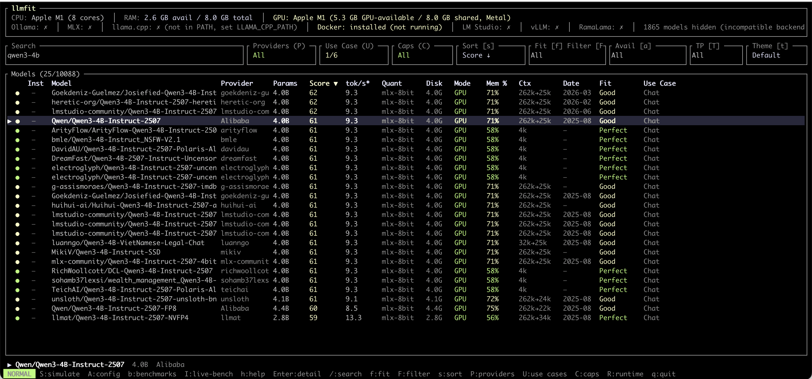

The actual test uses `qwen3:4b-q8_0` from the official Ollama model library. It is also 4B and 8-bit like Qwen3-4B-Instruct-2507 in llmfit, with the same memory and speed estimates, so the official version is used as the reference.

Note the top of the screen: **RAM: 2.6 GB avail / 8.0 GB total**. The 71% in the table is calculated against the 8GB total, but the MacBook only has 2.6GB of memory actually available at this moment.

### 2. Check the Memory Requirements on the Details Page

Press `Enter` to see the details. The Memory section lists the key information:

- **Rec RAM (recommended memory)**: 3.7GB, but only 2.6GB is currently available, so you can tell that it may slow down severely or even freeze
- **VRAM by Context**: A 4K context already needs 5.1GB, with only 5.3GB available to the GPU, which is almost at the limit
- **Disk/quant**: The 4-bit version of the same model needs only 2.2GB

> The Good on the list is calculated against the **8GB total** memory. But this MacBook has other programs open, and only **2.6GB** is actually available right now. From this you can **predict** that memory will run short when you run this model.

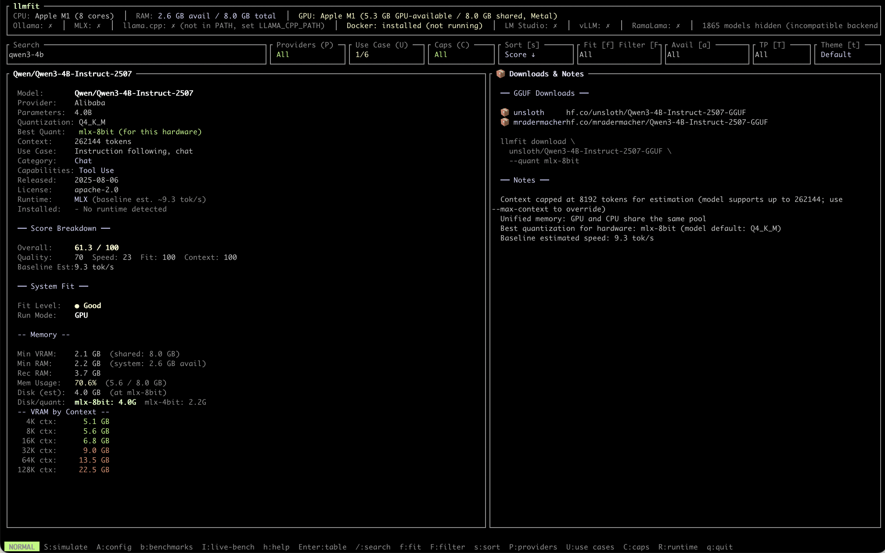

### 3. Actual Result

Run:

```bash
ollama run qwen3:4b-q8_0 --verbose
```

After typing just `hi`, the whole computer froze, and the answer finished almost **12 minutes** later at only **0.36 tokens/s**, more than 25 times slower than the estimated 9.3 tok/s.

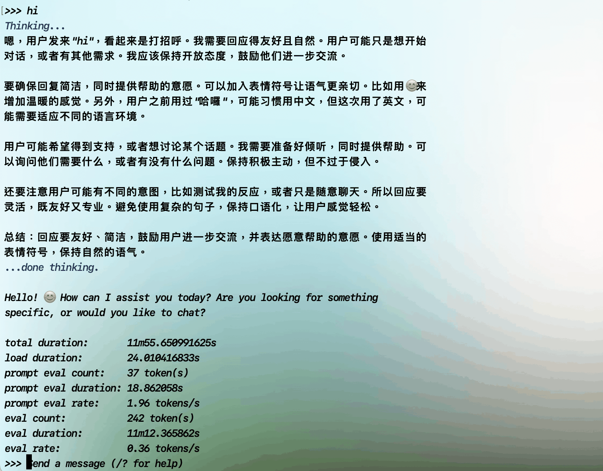

The cause is insufficient memory: the system uses the disk as a substitute for memory, and speed drops sharply. (Qwen3 thinks before answering by default, so Thinking content appears first.)

**Key point:** The Fit level on the list is calculated against **total** memory. Before running a model, compare **Rec RAM** on the details page with the **available memory** at the top of the screen. For models that use more than 70% of memory on a small laptop, close other programs first or switch to a more heavily compressed version (such as 4-bit).

## Part 4: Glows.ai RTX 4090 Test: Qwen3.6 27B

A MacBook with 8GB can smoothly run only models of roughly 1B–3B. To run larger, smarter models you need more VRAM. The following tests use a Glows.ai RTX 4090 instance.

### 1. Create an Instance

Click `Create New` to start creating an instance:

1. For GPU Model, select **`NVIDIA GeForce RTX 4090`** (24GB VRAM, 10 vCPUs, 50GB RAM, 0.490 Credit/h)
2. Search for `qwen` in the Official images and select **`Qwen3.6 27B Q4`** (Ollama and the qwen3.6:27b model are preinstalled)
3. Click `Complete Checkout` to create the instance

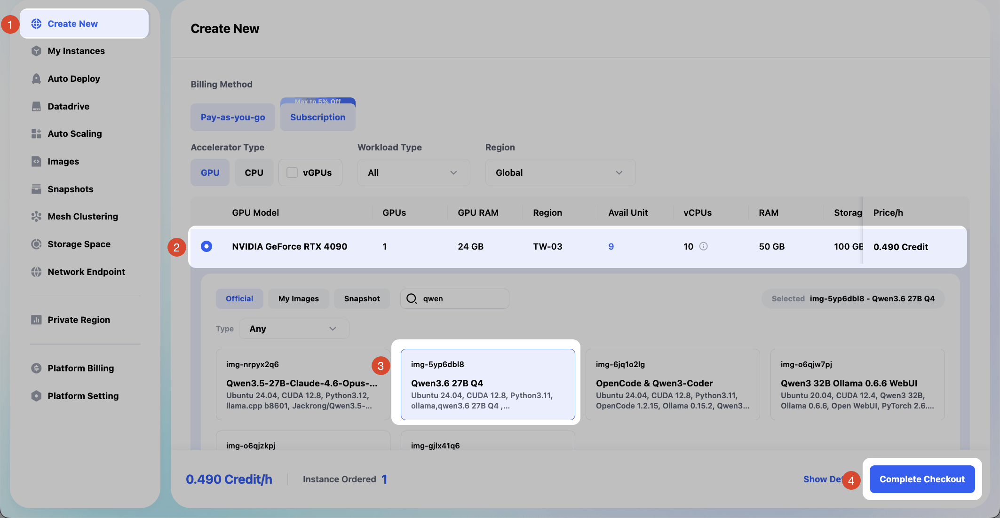

After the instance is running, on the instance page click `Access` > `SSH Port 22` > copy the SSH Command > use Password to connect to the instance over SSH.

### 2. Confirm the GPU and Model

After connecting to the instance, run:

```bash
nvidia-smi
ollama list
```

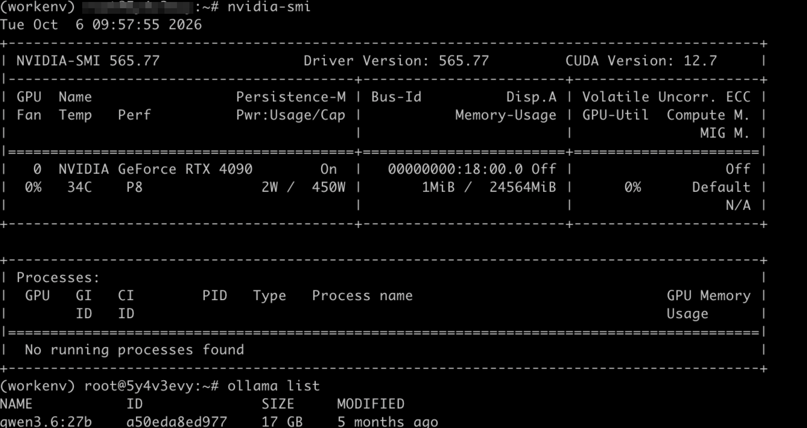

`nvidia-smi` shows the GPU is an **RTX 4090** with **24564MiB** of memory and only 1MiB in use, meaning no model is loaded yet. `ollama list` shows that **qwen3.6:27b** (17GB) is preinstalled in the image.

If `ollama list` returns a `could not connect` error, the Ollama service has not started. Run the following command first, then try again:

```bash
ollama serve > ollama.log 2>&1 &
```

### 3. Install llmfit

Run:

```bash
curl -fsSL https://llmfit.axjns.dev/install.sh | sh
```

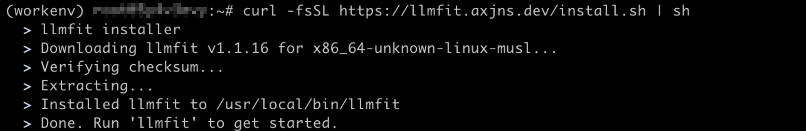

### 4. View llmfit's Evaluation

Run:

```bash
llmfit
```

The top of the screen detects an **NVIDIA GeForce RTX 4090 (24.0 GB, CUDA)**, and Ollama shows **✓ (1 installed)**. Compared with the MacBook, the top-scoring model jumps from 1B to the **27B class**, with an estimated speed of about 40–45 tok/s.

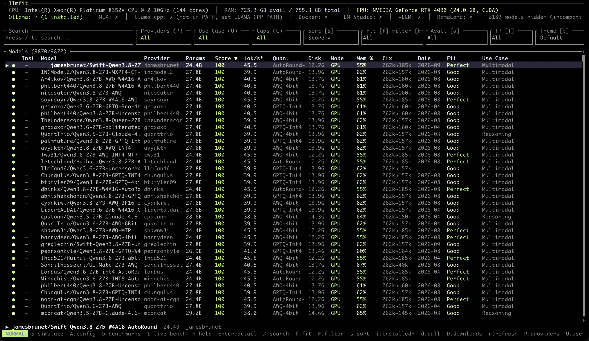

**CPU and RAM show the entire physical host** (144 cores, 755GB), not the 10 vCPUs and 50GB you actually rent. Running a model depends mainly on the GPU, and **the 24GB VRAM is detected correctly**, so the evaluation is not affected.

Most of the top-ranked entries are in AWQ, GPTQ, or AutoRound formats. These are mainly for vLLM and cannot be run directly by Ollama.

Press `i` to move installed models to the top. **Qwen/Qwen3.6-27B** has its Inst column checked, but Fit shows **Marginal** with Mem **97%**.

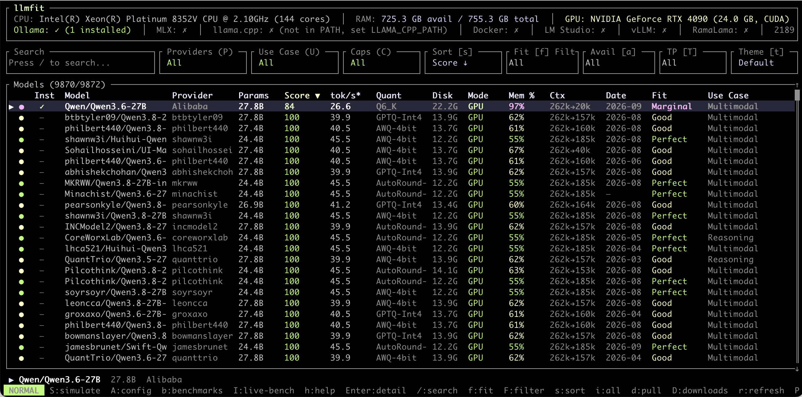

Press `Enter` to see the details:

- **Quantization**: Q4_K_M, the model's default version, which is the version installed in the image
- **Best Quant**: Q6_K (for this hardware), the version llmfit considers to have the best quality on this GPU

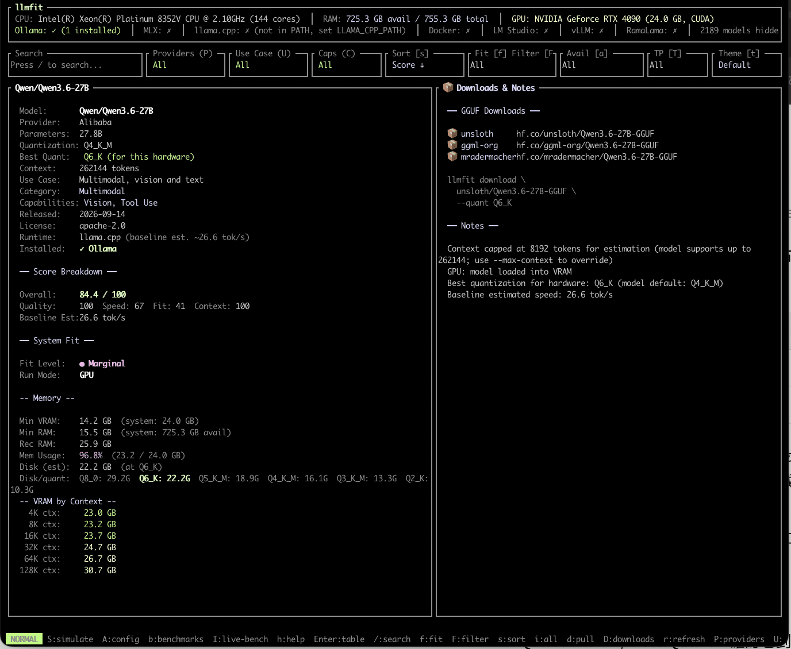

The Marginal on the list is calculated for **Q6_K (22.2GB)**, not the **Q4_K_M (16.1GB)** that is actually installed. The check in the Inst column only means "this model is installed"; the other values on the same row are the evaluation of the version llmfit recommends.

### 5. Confirm the Installed Quantization

Run:

```bash
ollama show qwen3.6:27b
```

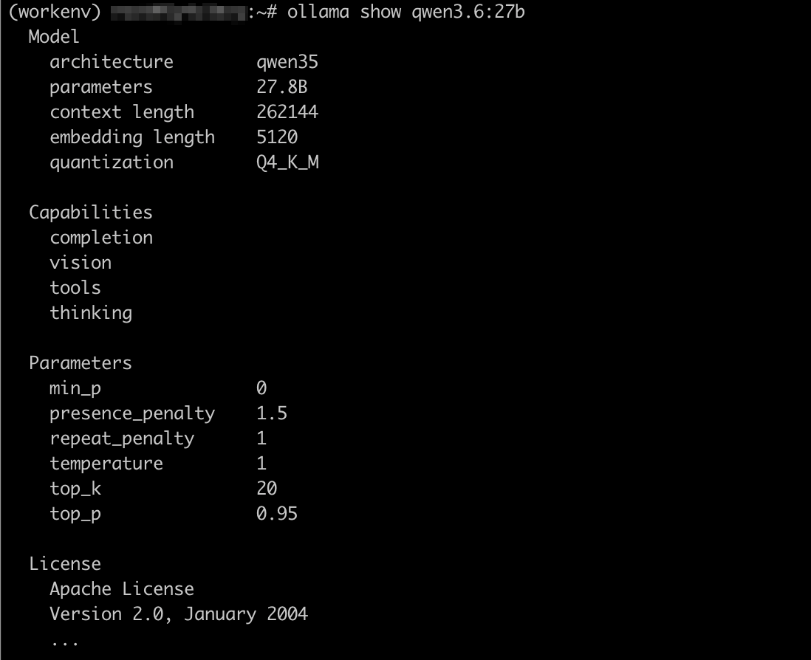

**quantization** shows **Q4_K_M**. **thinking** under Capabilities means the model thinks before answering by default.

Taking Q4_K_M as an example of a quantization name: **Q4** means each parameter is compressed to about 4 bits (a larger number means a larger file and better quality); **K** is the compression method; **M** is Medium, the mid-range variant at that bit width.

### 6. Test A: Image Default Settings (32K Context)

Run:

```bash
ollama run qwen3.6:27b --verbose
```

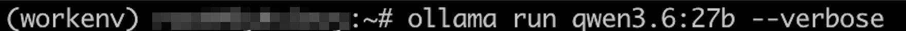

After entering the chat, first enter the following command to turn off thinking mode, then enter the test question:

```text
/set nothink
```

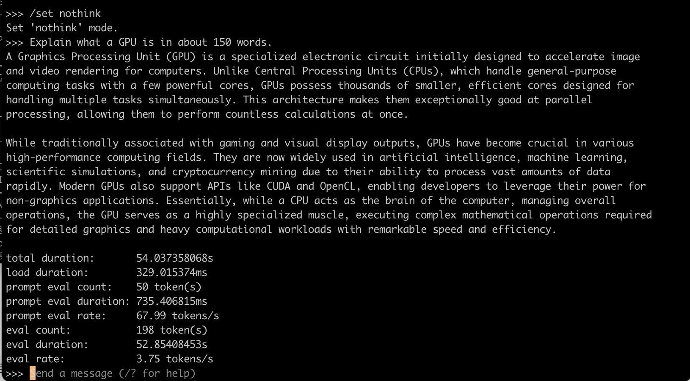

**Why turn off thinking mode?** Qwen3.6 reasons for a round before answering by default, producing a lot of thinking content even for simple questions. Llama 3.2 1B on the MacBook has no thinking mode, so with it turned off both answer directly, which makes the comparison fair. For complex math or reasoning problems, enter `/set think` to turn it back on.

The answer quality is clearly better than Llama 3.2 1B: it correctly says a GPU has "thousands of cores" and clearly explains the difference between a CPU and a GPU. But the speed is only **3.75 tokens/s**; 198 tokens took nearly 53 seconds.

Open another terminal tab and run `ollama ps`:

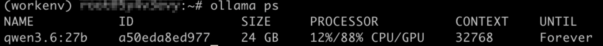

- **SIZE**: 24GB, filling the entire RTX 4090
- **PROCESSOR**: 12%/88% CPU/GPU, so 12% is assigned to CPU computation
- **CONTEXT**: 32768, the image's default context length is 32K

Besides the model itself, a model needs space to remember the conversation (the KV cache). The larger the context length, the larger this space, and Ollama **reserves the whole space in advance** when loading the model. A 32K context plus the 27B model exceeds 24GB, so whatever doesn't fit is computed by the CPU, and overall speed drops sharply. This also corresponds to **VRAM by Context** on the llmfit details page.

### 7. Test B: Reduce the Context Length to 4K

In the Ollama chat window, run:

```text
/set parameter num_ctx 4096
```

Enter the test question again. The model reloads with the new setting (load duration of about 14 seconds), and the speed recovers to **40.04 tokens/s**.

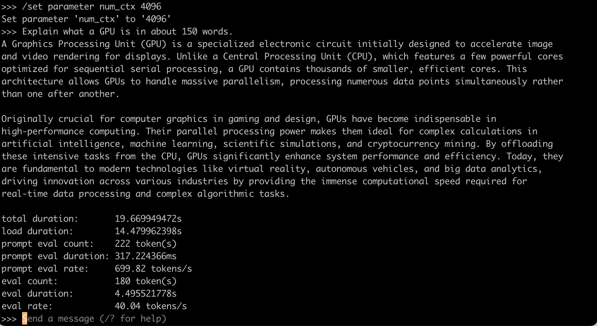

Run `ollama ps` again:

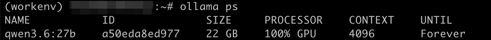

**SIZE** is 22GB, **PROCESSOR** is 100% GPU, and **CONTEXT** is 4096. The model is fully loaded on the GPU.

Run `nvidia-smi`:

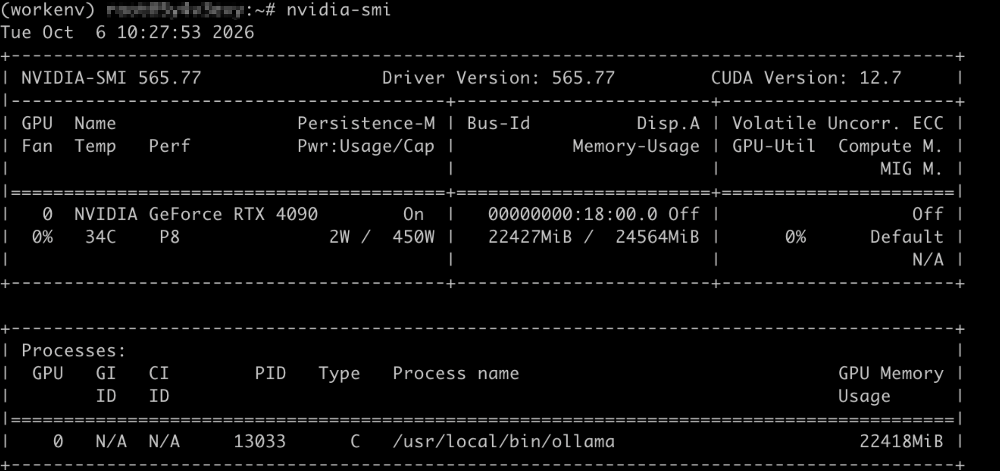

GPU memory usage is **22427MiB / 24564MiB**, used by ollama. Compared with 1MiB before loading, a 27B model fills almost all of the RTX 4090's memory, leaving only about 2GB.

We also re-tested on another instance with the same specs, and the speed was again about 41 tokens/s, so the result is reproducible.

| Context length | SIZE | PROCESSOR | Speed |
|---|---|---|---|
| 32K (image default) | 24 GB | 12%/88% CPU/GPU | 3.75 tok/s |
| **4K** | 22 GB | **100% GPU** | **40.04 tok/s** |

`/set parameter num_ctx` only applies to the current chat; after you exit and run again, it returns to the image default of 32K. If you need to read long documents or hold long conversations, use a GPU with more VRAM (for example, a 48GB L40S).

### 8. Stop the Instance When Testing Is Done

Glows.ai instances are billed by usage time. When you finish testing, first type `/bye` to exit Ollama, then go to `My Instances` and stop or delete the instance to avoid ongoing charges.

## Part 5: Summary of Results

### 1. Measured Results

| Machine | Model | llmfit evaluation | Measured speed | Measured memory | Conclusion |
|---|---|---|---|---|---|
| MacBook M1 8GB | Llama 3.2 1B (Q8_0) | Perfect, 35 tok/s | **42.53 tok/s** | 1.5 GB, 100% GPU | Accurate estimate; fast, but details can be wrong |
| MacBook M1 8GB | Qwen3 4B (8-bit) | Good, 9.3 tok/s | **0.36 tok/s** | Out of memory, system froze | Not enough available memory; unusable |
| RTX 4090 24GB | Qwen3.6 27B (Q4_K_M), 32K | Marginal (evaluated at Q6_K) | **3.75 tok/s** | 24 GB, 12%/88% CPU/GPU | Context too large; slowed by the CPU |
| RTX 4090 24GB | Qwen3.6 27B (Q4_K_M), 4K | — | **40.04 tok/s** | 22 GB, 100% GPU | Runs at full speed; answer quality clearly better |

### 2. MacBook vs. RTX 4090

| Item | MacBook M1 8GB | RTX 4090 24GB |
|---|---|---|
| Model that runs smoothly | Llama 3.2 1B | **Qwen3.6 27B** |
| Speed | 42.53 tok/s | **40.04 tok/s** |
| Answer quality | Fluent, but with factual errors | Correct and complete |

The model is more than 20 times larger, the speed is almost the same, and the answer quality is clearly better.

### 3. Cost Estimate

The RTX 4090 instance costs 0.490 Credit/h. At the measured 40.04 tok/s of continuous generation, it produces about 144,000 tokens per hour, so **generating 1 million tokens costs about 3.4 Credits**.

This is an estimate for a single user generating continuously; actual cost varies with how you use it.

### 4. Recommendations for Using llmfit

1. **Look at Fit first, then Mem %**: Prefer Perfect or Good, and keep Mem % under 70% to be safe
2. **A high Score does not mean the smartest**: Score is a balanced score on that machine. If you need a smarter model, choose one with more parameters
3. **Confirm the quantization**: llmfit calculates with its recommended version, which is not necessarily the one you installed. Use `ollama show` to confirm the quantization, then compare it with Disk/quant on the details page
4. **Confirm the actual available memory**: The list is calculated against total memory. Before running, compare Rec RAM on the details page with the available memory at the top of the screen
5. **Context length takes up VRAM**: When speed is abnormally slow, first check with `ollama ps` whether PROCESSOR is 100% GPU, and lower `num_ctx` if needed
6. **On cloud instances, go by VRAM**: The CPU and RAM that llmfit reads may be values for the entire physical host
7. **Always test in the end**: llmfit quickly narrows down models, but actual performance still has to be verified by running them

## Contact Us

If you have any questions or suggestions while using Glows.ai, feel free to contact us via email, Discord, or Line.

**Email:** [support@glows.ai](mailto:support@glows.ai)

**Discord:** [https://discord.com/invite/glowsai](https://discord.com/invite/glowsai)

**Line:** [https://lin.ee/fHcoDgG](https://lin.ee/fHcoDgG)
